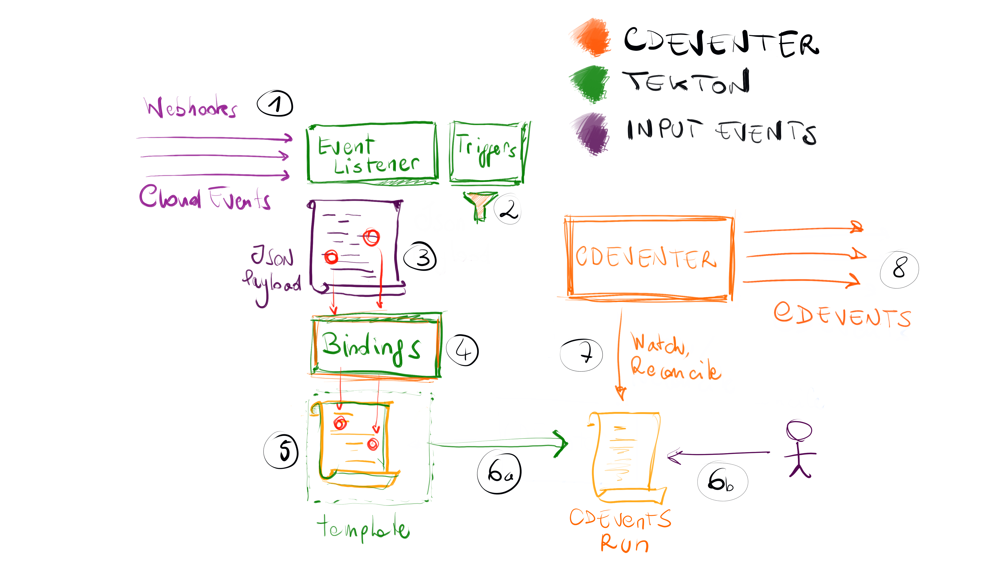

# CDEventer

A Tekton custom task and trigger resources to send CDEvents

## Getting Started

Build and deployment of *CDEventer* is managed via [`ko`]https://github.com/google/ko).
To install CDEventer, clone the repo, point `KO_DOCKER_REPO` to your container
registry:

```shell
export KO_DOCKER_REPO=icr.io/cdeventer
ko apply -f config
```

## Send a CDEvent by creating a `Run`

*CDEventer* looks for `Run` resources in the cluster that reference a resource
of kind `CDEvent` and api version `custom.tekton.dev/v0`. The `CDEvent` resource
does not actually need to exist, the `Run` and its parameters are all that is
required. For example:

```yaml
apiVersion: tekton.dev/v1alpha1
kind: Run
metadata:
  generateName: cdevent-
spec:
  ref:
    apiVersion: custom.tekton.dev/v0
    kind: CDEvent
  params:
    - name: context
      value:
        type: dev.cdevents.taskrun.started.v1
        source: cdeventerRun
    - name: subject
      value:
        id: myTaskRun123
        pipelineName: myPipeline
        url: http://example.com/myTaskRun123
    - name: data
      value:
        customDataContentType: "application/json"
        customData: "{\"k1\": \"v1\"}"
```

## Architecture



- A Tekton Event Listener creates and end-point (or sink) for incoming events and webhooks (1)
- Tekton Triggers allow filtering (2) incoming events, so that we only process those we are
  interested into 
- Tekton Trigger Bindings (4) map data from the input JSON payload and headers (3) into input
  specific Trigger Templates (5)
- The Template is filled in and a CDEvents `Run` is created (6a) on the Kubernetes Cluster
- The CDEvents `Run` can also be created directly by a user (6b), like in the
  [YAML example above](#send-a-cdevent-by-creating-a-run)
- The CDEventer controller watches CDEvents `Runs`. It reconciles them by sending one CDEvent
  for each `Run` (8), through the CDEvents go SDK
